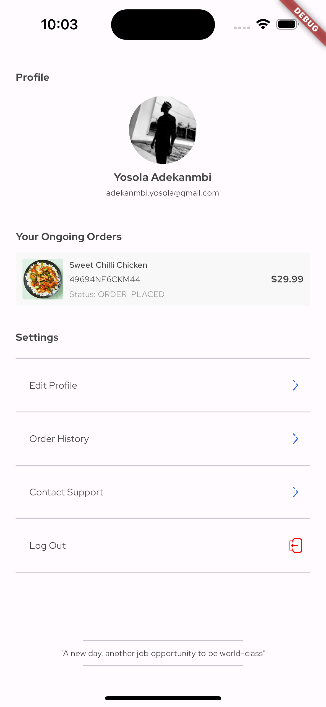

# Eden Test - Order Tracking App

## Overview

This project is an order tracking app built using Flutter, Firebase Auth, and Ably Realtime. The app allows users to sign in with Google or GitHub using Firebase Auth. Upon signing in, users can view their order details, including real-time updates on the order status.

## Requirement

## Features

- User authentication with Google and GitHub via Firebase Auth.
- Real-time order status updates using Ably Realtime.
- State management with Riverpod for clean and efficient data handling.
- Clean and intuitive UI for order details and status tracking.

## Screenshots and Demo

<table>
  <tr>
    <td align="center">
      
    </td>
    <td align="center">
      
    </td>
    <td align="center">
      
    </td>
    <td align="center">
      
    </td>
  </tr>
</table>

## Tech Stack

- Flutter: The app is built using the Flutter framework for cross-platform development.
- Firebase Auth: Used for user authentication.
- Localization: Utilized for supporting multiple languages.
- Ably Realtime: Utilized for real-time updates on order status.
- Riverpod: Employed for state management in the app.
- GitHub Sign-In and Google Sign-In: Integrated for authentication.

## Code Structure

- **`lib/features/auth`**: Contains the authentication-related code.
- **`lib/features/orders`**: Manages the order-related functionality.
- **`lib/localization`**: Holds localization-related files.
- **`lib/shared`**: Contains shared components, utilities, or services.

## How to Run

1. Clone the repository.
2. Open the project in your preferred Flutter IDE.
3. Ensure dependencies are installed using `flutter pub get`.
4. Run the app using `flutter run`.

## Testing with Ably

To test the real-time order status updates using Ably, follow these steps:

1. Go to the [Ably Dashboard](https://dashboard.ably.com/signup) and sign up for an account if you don't have one.
2. Create a new Ably application from the dashboard.
3. Obtain your Ably API key and replace the `ablyApiKey` constant in `lib/secrets.dart` file with the new key.
4. In the Ably dashboard, navigate to the "Channels" section and create a channel named 'order-status'.
5. Use the Ably dashboard to publish messages to the 'order-status' channel with the following details:
    - **Event Name:** `ORDER_STATUS`
    - **Message Data:** Use either of the following keywords:
        - `ORDER_PLACED`
        - `ORDER_ACCEPTED`
        - `ORDER_PICK_UP_IN_PROGRESS`
        - `ORDER_ON_THE_WAY_TO_CUSTOMER`
        - `ORDER_ARRIVED`
        - `ORDER_DELIVERED`

Now, when you run the application, it should receive real-time updates on the order status from the Ably channel.

## Future Improvements

To consider the following enhancements for future iterations of the Eden Application:

1. **Time for Each Delivery Status:**
   - Implement a feature that displays the timestamp for each delivery status received from Ably. This addition can provide users with more precise information about the timing of order status updates.

2. **Profile Settings:**
   - Develop a profile settings section where users can customize their preferences, update personal information, or modify notification settings. This feature adds a layer of personalization to enhance the user experience.

3. **Real-time Push Notifications on Status Update:**
   - Integrate real-time push notifications to notify users instantly when there is a change in their order status. This ensures that users stay informed about their orders without actively checking the app.

---
